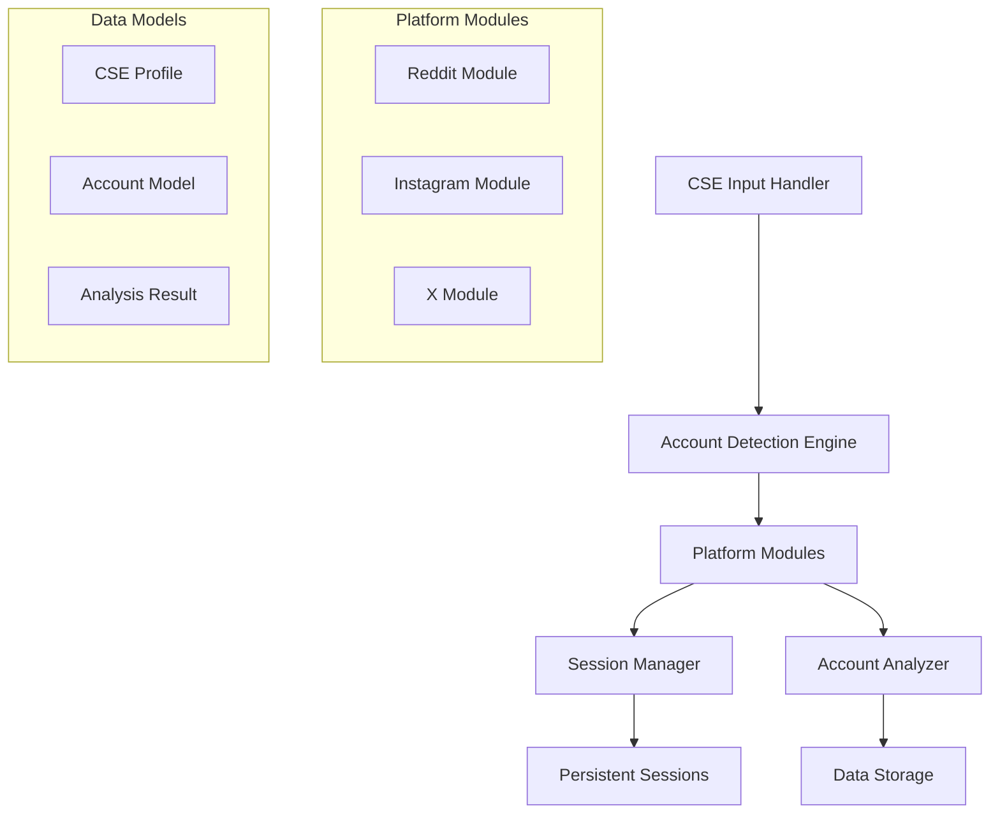

# Design Document

## Overview

The phishing account detector transforms the existing URL-focused social media scraper into a modular system that identifies suspicious accounts potentially targeting Critical Sector Entities (CSEs). The system maintains the existing browser automation and session management infrastructure while shifting focus from URL extraction to account analysis and comparison.

## Architecture

### High-Level Architecture



### Core Components

1. **CSE Input Handler**: Processes Critical Sector Entity profiles provided as input
2. **Account Detection Engine**: Orchestrates the search and analysis of potential phishing accounts
3. **Platform Modules**: Modular scrapers for each social media platform
4. **Session Manager**: Handles persistent login sessions across platforms
5. **Account Analyzer**: Compares discovered accounts against CSE profiles
6. **Data Storage**: Manages CSE profiles, account data, and analysis results

## Components and Interfaces

### CSE Profile Management

```python
class CSEInputHandler:
    """Handles input and processing of Critical Sector Entity profiles"""
    
    def load_cse_profiles(self, input_source: str) -> List[CSEProfile]
    def validate_cse_data(self, profile: CSEProfile) -> bool
    def extract_search_terms(self, profile: CSEProfile) -> List[str]
```

### Account Detection Engine

```python
class AccountDetectionEngine:
    """Main orchestrator for phishing account detection"""
    
    def __init__(self, platform_modules: Dict[str, BasePlatformModule])
    def detect_phishing_accounts(self, cse_profiles: List[CSEProfile]) -> List[AnalysisResult]
    def search_accounts_by_cse(self, cse_profile: CSEProfile) -> List[Account]
```

### Enhanced Platform Modules

```python
class BasePlatformModule:
    """Base class for platform-specific account detection"""
    
    def __init__(self, browser_manager: BrowserManager, config: PlatformConfig)
    def login_with_persistence(self) -> bool
    def search_accounts(self, search_terms: List[str]) -> List[Account]
    def analyze_account_profile(self, account: Account) -> AccountAnalysis
    def get_account_details(self, account_id: str) -> Account
```

### Session Management Enhancement

```python
class EnhancedSessionManager:
    """Enhanced session management with automatic persistence"""
    
    def check_existing_session(self, platform: str) -> bool
    def load_persistent_session(self, platform: str) -> bool
    def save_session_data(self, platform: str, session_data: dict) -> bool
    def prompt_manual_login(self, platform: str) -> bool
```

## Data Models

### CSE Profile Model

```python
@dataclass
class CSEProfile:
    """Critical Sector Entity profile for comparison"""
    entity_id: str
    entity_name: str
    entity_type: str  # "government", "infrastructure", "financial", etc.
    official_accounts: Dict[str, str]  # platform -> official_username
    key_personnel: List[str]  # Names of key personnel
    official_domains: List[str]  # Official website domains
    sector_classification: str
    search_keywords: List[str] = field(default_factory=list)
    created_at: str = field(default_factory=lambda: datetime.now().isoformat())
```

### Enhanced Account Model

```python
@dataclass
class Account:
    """Social media account information for analysis"""
    platform: str
    account_id: str
    username: str
    display_name: str
    profile_url: str
    
    # Profile analysis data
    bio_description: str = ""
    profile_image_url: str = ""
    follower_count: int = 0
    following_count: int = 0
    post_count: int = 0
    account_creation_date: Optional[str] = None
    verification_status: bool = False
    
    # Phishing indicators
    suspicious_indicators: List[str] = field(default_factory=list)
    similarity_score: float = 0.0
    target_cse_id: Optional[str] = None
    
    # Recent activity
    recent_posts: List[str] = field(default_factory=list)  # Post IDs
    engagement_patterns: Dict[str, Any] = field(default_factory=dict)
    
    def add_suspicious_indicator(self, indicator: str) -> None:
        """Add a suspicious behavior indicator"""
        if indicator not in self.suspicious_indicators:
            self.suspicious_indicators.append(indicator)
    
    def calculate_risk_score(self) -> float:
        """Calculate overall risk score based on indicators"""
        base_score = self.similarity_score
        indicator_weight = len(self.suspicious_indicators) * 0.1
        return min(base_score + indicator_weight, 1.0)
```

### Analysis Result Model

```python
@dataclass
class AnalysisResult:
    """Result of phishing account analysis"""
    analysis_id: str
    cse_profile_id: str
    detected_accounts: List[Account]
    analysis_timestamp: str
    platform: str
    
    # Analysis metrics
    total_accounts_analyzed: int = 0
    suspicious_accounts_found: int = 0
    high_risk_accounts: List[str] = field(default_factory=list)  # Account IDs
    
    # Analysis parameters
    search_terms_used: List[str] = field(default_factory=list)
    detection_criteria: Dict[str, Any] = field(default_factory=dict)
    
    def get_high_risk_accounts(self) -> List[Account]:
        """Get accounts with risk score above threshold"""
        return [acc for acc in self.detected_accounts if acc.calculate_risk_score() > 0.7]
```

## Error Handling

### Session Management Errors

- **Invalid Session**: Gracefully fall back to manual login prompt
- **Session Expiry**: Detect expired sessions and request re-authentication
- **Platform Unavailable**: Handle platform-specific outages with appropriate messaging

### Account Detection Errors

- **Search Failures**: Log failed searches and continue with available data
- **Rate Limiting**: Implement exponential backoff and respect platform limits
- **Data Parsing Errors**: Handle malformed account data gracefully

### CSE Input Errors

- **Invalid Format**: Provide clear validation messages for CSE input data
- **Missing Required Fields**: Identify and report missing critical information
- **Duplicate Entries**: Handle duplicate CSE profiles appropriately

## Testing Strategy

### Unit Testing

- **Data Models**: Test CSE profile validation, account data processing, and analysis calculations
- **Session Management**: Test session persistence, expiry detection, and fallback mechanisms
- **Account Analysis**: Test similarity scoring, indicator detection, and risk calculation

### Integration Testing

- **Platform Modules**: Test account search and data extraction across platforms
- **End-to-End Workflows**: Test complete CSE input to analysis result workflows
- **Session Persistence**: Test login persistence across application restarts

### Security Testing

- **Credential Handling**: Ensure no credentials are logged or exposed
- **Session Security**: Test secure storage and retrieval of session data
- **Data Sanitization**: Test handling of malicious or unexpected input data

## Implementation Notes

### Commenting Out Automatic Login

All existing automatic login code that uses environment variables will be commented out by default:

```python
# AUTOMATIC LOGIN DISABLED - Use manual login or persistent sessions
# username = os.getenv('REDDIT_USERNAME')
# password = os.getenv('REDDIT_PASSWORD')
# if username and password:
#     await self.login(username, password)
```

### Modular Platform Design

Each platform module will inherit from `BasePlatformModule` and implement:
- Account search functionality
- Profile data extraction
- Platform-specific analysis methods
- Session management integration

### Persistent Session Strategy

- Sessions stored in `persistent_sessions/` directory
- Platform-specific session files with encryption
- Automatic session validation on startup
- Graceful fallback to manual login when needed